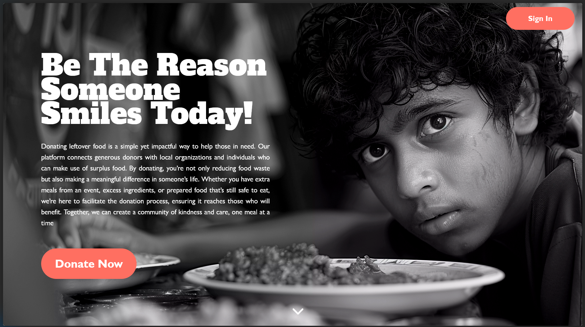
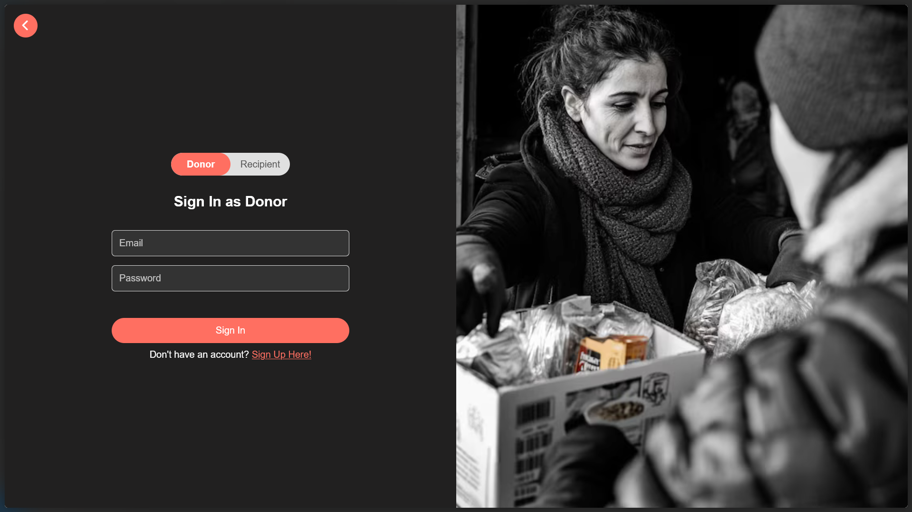
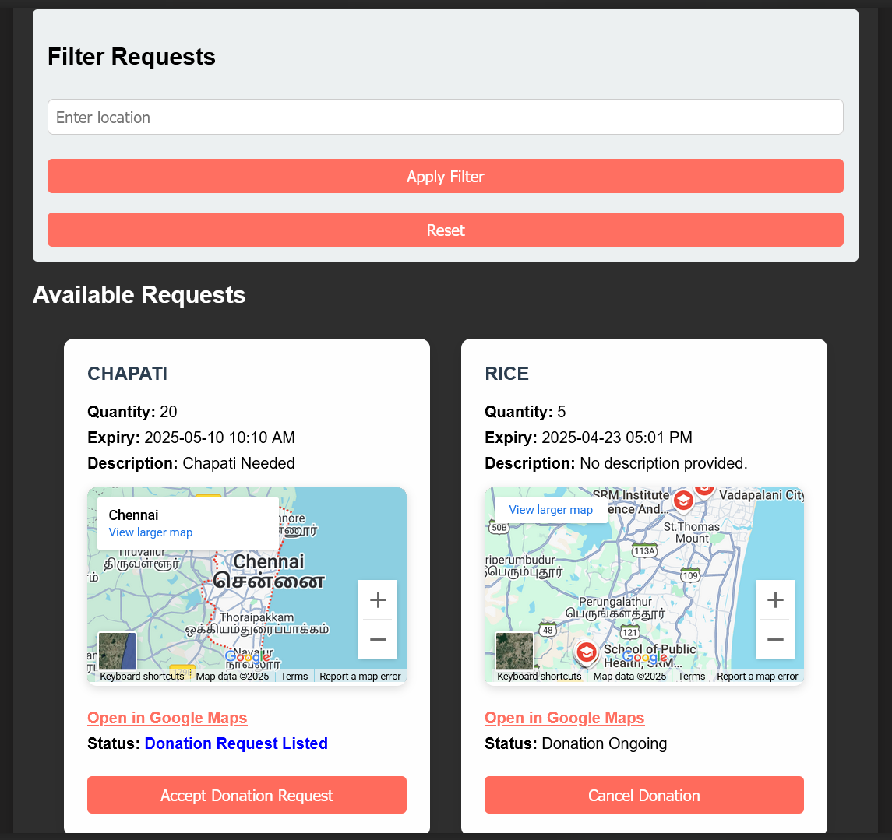

# DonateADish -> Food Donation Made Seamless

**Website**: [donateadish.onrender.com](http://donateadish.onrender.com)

 


## About the Project

**DonateADish** is a web-based platform that bridges the gap between food donors and NGOs serving underprivileged communities. Whether it's leftover food from events or surplus stock from restaurants, we help ensure it reaches people in need—**instead of the landfill**.

### Why DonateADish?

Every day, **tons of edible food is wasted** while millions go to bed hungry. We decided to change that narrative with a tech-driven solution.

Our platform allows:
- **Individuals**, **restaurants**, and **event organizers** to **donate surplus food**
- **NGOs** to browse, claim, and request food donations in real-time
- **Users** to track donation statuses and get involved in meaningful social impact

---

## Key Features

- **Secure Authentication** with role-based access for Donors & Recipients
- **Food Request Listings** – NGOs can post specific needs; donors can browse and contribute
- **Donation Tracking System** – Real-time updates on donation status: Acknowledgement Pending, Accepted, Ongoing
- **Social Gamification** – Earn badges and share your good deeds online!
- **Location-Aware Search** – Filter food requests by location
- **Tech Stack Power** – Flask, HTML/CSS/JavaScript, MySQL (via Aiven Cloud)

---

## System Architecture

```
Donor / Recipient
      |
Frontend: HTML + CSS + JS
      |
Backend: Python Flask (REST APIs)
      |
Database: MySQL (Aiven Cloud)
```

---

## Screenshots

### 1. Landing Page


### 2. Login Page


### 3. Donor Dashboard


---

## Limitations & Future Work

- **Internet Dependency**: Requires stable connectivity
- **No AI Yet**: Future versions will include smart matching and demand prediction
- **Scalability**: Currently supports moderate traffic; cloud scaling planned
- **Awareness**: Needs more outreach—help us spread the word!

---

## Aligned With United Nations SDGs

- **SDG 2: Zero Hunger**
- **SDG 3: Good Health and Wellbeing**
- **SDG 17: Partnerships for the Goals**

---

## Developers

**Devansh Verma**  
**Shubh Chaturvedi**

---

## Live Demo

Check it out: [donateadish.onrender.com](http://donateadish.onrender.com)

---

## Want to Contribute?

We'd love your help! Coming soon:
- AI Matching Engine
- Enhanced Analytics for NGOs
- Native mobile app

**Star the repo, fork it, and let’s reduce food waste together!**
